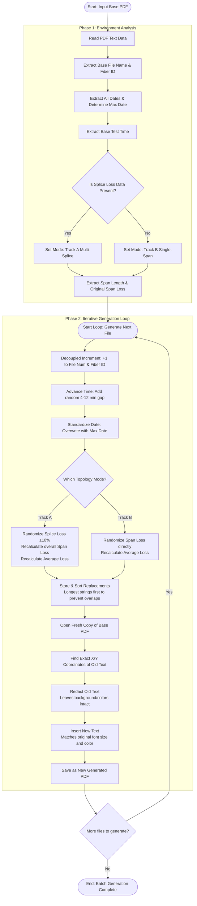

# OTDR Report Batch Generator

This program automates the generation of sequential Optical Time-Domain Reflectometer (OTDR) reports. It takes a single base trace report, analyzes its physical and chronological environment, and mathematically generates a batch of consecutive reports with realistic, randomized variance.

## How It Works

The system operates on a non-destructive "read, recalculate, and overwrite" model. It does not blindly replace text; instead, it treats the OTDR report as a system of dependent mathematical equations to ensure every generated file is physically sound and logically credible.

## The Algorithm

The core logic is designed to be language-agnostic and can be implemented in any language capable of text parsing and coordinate-based document redaction.

### Phase 1: Environment Analysis

1. **Extract Identifiers:** Parse the document to find the base File Name (e.g., `Fiber4.trc`) and the base Fiber ID (e.g., `Fiber18`).
2. **Extract Chronology:** Locate the Test Date, Test Time, and Signature/Calibration Dates.
3. **Normalize Dates:** Scan all extracted dates to find the chronological maximum (the latest date). This "Max Date" is saved to overwrite any outdated test dates.
4. **Determine Topology:** Check for the presence of splice loss data.
* If splice data exists $\rightarrow$ Route to **Track A (Multi-Splice)**.
* If splice data is blank $\rightarrow$ Route to **Track B (Single-Span)**.

### Phase 2: Iterative Generation Loop

For each target file in the desired sequence (e.g., File 5 through 12), the algorithm executes the following steps:

1. **Decoupled Incrementing:** Add $+1$ to both the File Name number and the Fiber ID independently to maintain parallel sequences.
2. **Chronological Advancement:** Add a randomized time gap (e.g., 4 to 12 minutes) to the previous test time.
3. **Mathematical Randomization (The Physics Engine):**
* **Track A (Splice Present):** Randomize the individual *splice loss* by a bounded margin ($\pm 10\%$). Recalculate the overall span loss based on the new splice difference, then calculate the new average loss ($Average = Span Loss \div Span Length$).
* **Track B (Single-Span):** Randomize the overall *span loss* directly by a bounded margin. Recalculate the new average loss using the fixed span length.

4. **Targeted Redaction:** Locate the exact physical X/Y coordinates of the original data points on the document page.
5. **Clean Overwrite:** Delete the old text strings without affecting the background colors or table grids. Insert the newly calculated values into the exact same coordinates, matching the original font size, weight, and color.

## Flow Diagram

## Key Features

* **Decoupled IDs:** Handles environments where the File Number and Fiber ID do not match.
* **Threshold Agnostic:** Randomizes values purely based on physical math, leaving Pass/Fail threshold flags intact and mathematically accurate.
* **Blank Field Preservation:** Safely ignores empty anchor fields (Operator, Location, etc.) without crashing.

---
